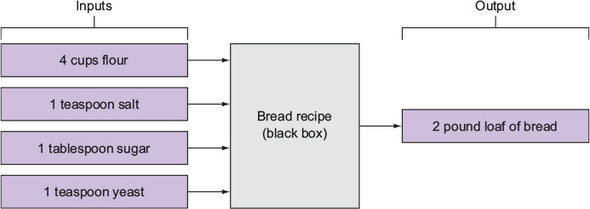

# 1 - Intro and Why Learn How to Program?

This course is divided into units.

Each unit contains a number of lessons that deals with one particular concept in programming.

Each unit ends with a 'capstone'. Step-through solutions are given.

# 2 - Basic Principles of Learning a Programming Language

## Programming as a Skill

- Write out as much code as possible. Type out every piece of code that you see without copying and pasting.

### A Parallel with Baking

- Make sure you understand the given task. Good to ask clarifying questions:
  - Desired loaf size?
  - Flavored?
  - Unwanted or unavailable ingredients?
  - Required equipment?
    - Self supplied or provided by someone else?
  - Time limit?
  - Pre-existing recipe?
- Find a recipe:
  - Steps to take and in what order.
  - Specific measurements.
  - When and how to repeat a task.
  - Allowed substitutions.
  - Finishing and plating instructions.
- Visualize with flowcharts:
  - Steps are entered in rectangular boxes.
  - Substitutions entered in a diamond box.
  - For repeating tasks, draw an arrow going back up to the first step in the repeated sequence:

- Think, Code, Test, Debug, Repeat:
  - Think = making sure you understand what you are supposed to be making.
  - Code = Experimenting with combinations of ingredients, substitutions, repeated steps,etc.
    - The implementation of an algorithm.
  - Test = Determining whether the final product matches the project specifications. Does the actual output match up with the expected output.
  - Debug = Tweaking the recipy to smooth out any errors and unwanted artifacts.
  - Repeat the above four steps until the code/recipe passes all of the tests.

- It's always a good idea to think about the program definition and flow before you commence coding.
- Harder problems are best broken down into smaller, simpler problems.
- Good questions to ask:
  - What is this program supposed to accomplish?
  - Are there any interactions with the user?
  - What type of input is the user giving you?
  - What does the user want from the program and in what form?
- Organize your thoughts by doing the following:
  - Visualize the problem.
  - Write down some sample inputs and expected outputs.

Black-box visualization example:

### Pseudocode

Convert flowcharts and drawings into words using programming concepts.

*pseudocode* is a mix of english and programming on paper.

Example of pseudocode for finding the area of a circle:
1. Get a radius from the user.
2. Apply a formula.
3. Show the result.
4. Repeat 1-3 until the user terminates the process.

## Writing Readable Code

Write code with the intent that someone else (including future you) will read it.

- Use descriptive and meaningful names.
- Comment your code.
  - In python, comments begin with `#`.
  - Comments aren't executed.
  - Can be used to describe important parts of the code.
  - Should be used to help readers understand why the code is written in a particular way.
  - 